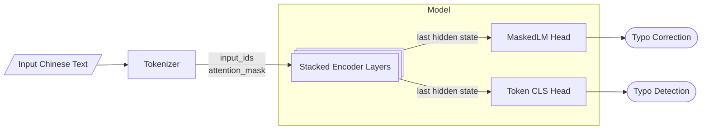

# Chinese Hanzi Typo Checker

## Introduction
In Chinese text scenarios, typos are inevitable due to the input method, as most Chinese characters are entered using pinyin. Additionally, Chinese characters are phono-semantic compounds (形声字), which further contributes to typo occurrences.

Therefore, techniques for detecting and correcting typos in Chinese text are highly valuable and in demand. This repository aims to build a Chinese typo checker by leveraging the capabilities of masked language models like BERT.


## Method



## How to Use
Download model weight from [here](https://drive.google.com/drive/folders/1qxJ481h2A1gqAy4VPK60oOpt-6nlcHeX?usp=sharing)

```python
from checker import HZTypoChecker

tokenizer_name = "data/bert"

model_name = "where you download the model weights"


ckecker = HZTypoChecker(model_name, tokenizer_name)
```
give a txt may contains typos
```python
txt = "忧 质 的 产 品 和 服 务 实 际 上 是 最 好 的 晶 牌 推 厂 方 式 。"
# typos 忧(优)  晶（品） 厂（广）
```
calling checker to detect typos
```python 
ck_out = ckecker.check(txt)
```

```python
print(ck_out.raw_tokens)
print(ck_out.check_cls)
print(ck_out.mod_tokens)
```
```sh
['[CLS]', '忧', '质', '的', '产', '品', '和', '服', '务', '实', '际', '上', '是', '最', '好', '的', '晶', '牌', '推', '厂', '方', '式', '。', '[SEP]']
[1, 0, 1, 1, 1, 1, 1, 1, 1, 1, 1, 1, 1, 1, 1, 1, 0, 1, 1, 0, 1, 1, 1, 1]
['[CLS]', '优', '质', '的', '产', '品', '和', '服', '务', '实', '际', '上', '是', '最', '好', '的', '品', '牌', '推', '广', '方', '式', '。', '[SEP]']
```
