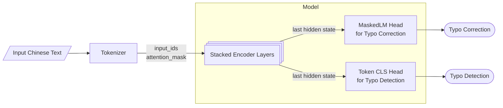

# Chinese Hanzi Typo Checker

## Introduction
In Chinese text scenarios, typos are inevitable due to the input method, as most Chinese characters are entered using pinyin. Additionally, Chinese characters are phono-semantic compounds (形声字), which further contributes to typo occurrences.

Therefore, techniques for detecting and correcting typos in Chinese text are highly valuable and in demand. This repository aims to build a Chinese typo checker by leveraging the capabilities of masked language models like BERT.

